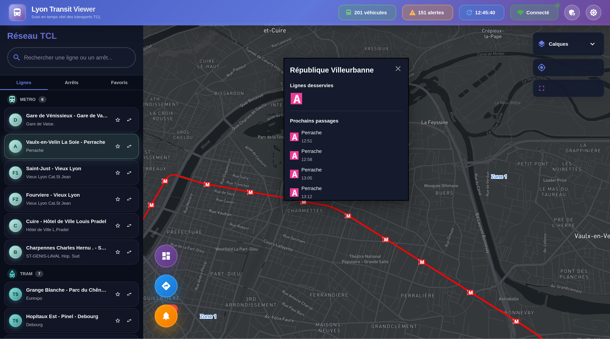
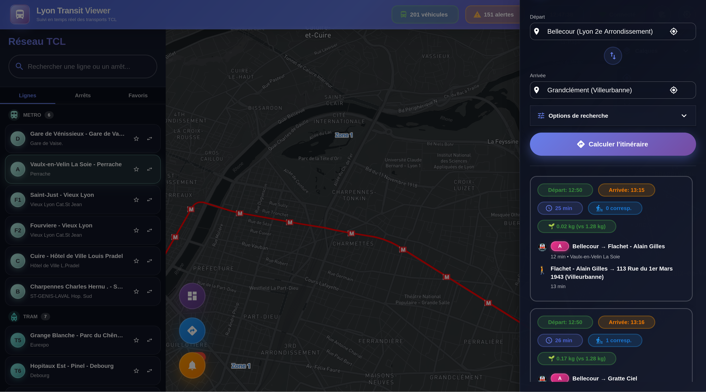
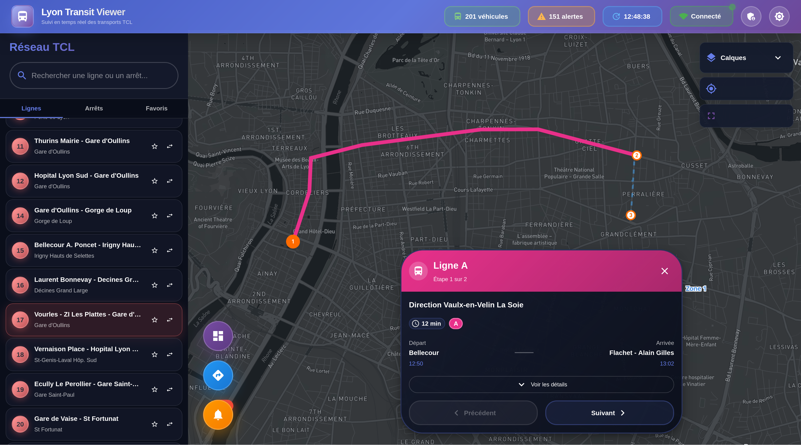
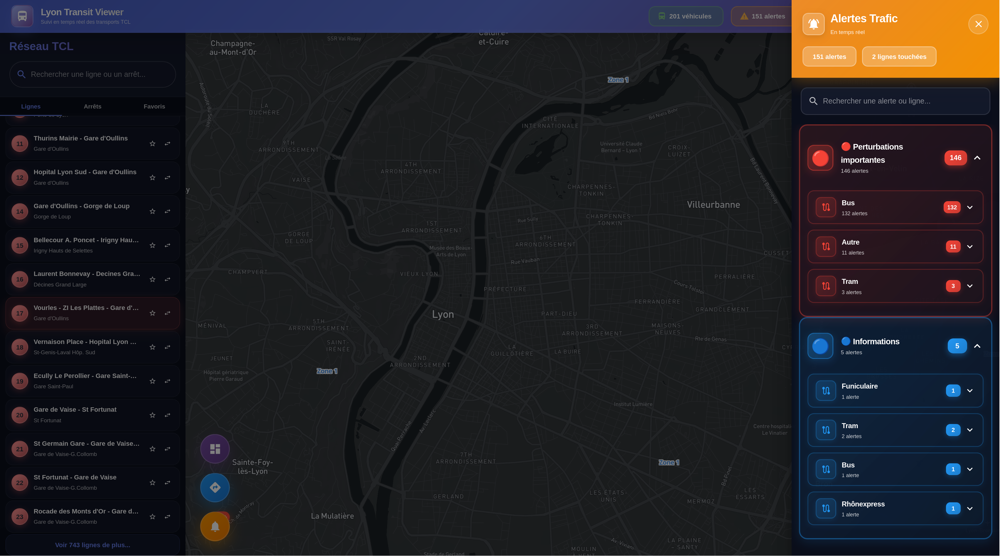

# Lyon Transit Viewer

## Aperçu du Projet

Cette application web a pour but de visualiser en temps réel le système de transport en commun de Lyon, France. Elle est composée d'un frontend en React, d'un backend en Node.js (Express) et d'une base de données PostgreSQL. L'ensemble est conteneurisé avec Docker.

L'objectif est d'afficher des informations en temps réel sur les lignes de bus, métro, tramway et funiculaire, y compris la position des véhicules et les alertes de service, sur une carte interactive.

## 📸 Aperçu

### Interface Principale


### Recherche de trajet


### Détails Trajet


### Dashboard


### Panneau d'alerte


## Technologies Clés

*   **Frontend:**
    *   React 18
    *   Zustand pour la gestion de l'état
    *   TanStack React Query (v4) pour le data fetching
    *   Mapbox-GL pour la carte interactive
    *   Material-UI pour les composants UI
    *   TypeScript
*   **Backend:**
    *   Node.js avec Express
    *   TypeScript
    *   PostgreSQL comme base de données
    *   `node-cron` pour la récupération planifiée des données depuis l'API GrandLyon
*   **DevOps:**
    *   Docker et `docker-compose`

## Démarrage et Exécution

L'application est entièrement gérée par `docker-compose`.

### Première Installation

Pour construire et démarrer tous les services (frontend, backend, db) en mode détaché :

```bash
docker-compose up --build -d
```

- Le frontend sera accessible à [http://localhost:3000](http://localhost:3000).
- L'API backend sera à [http://localhost:5000](http://localhost:5000).

---

## Architecture et Flux de Données

L'application fonctionne en deux temps : l'initialisation des données statiques et la mise à jour continue des données temps réel.

### 1. Le rôle des données GTFS (Données Statiques)

Le répertoire `backend/gtfs/` contient des fichiers texte (`stops.txt`, `routes.txt`, etc.) qui suivent la norme **GTFS (General Transit Feed Specification)**. Ces fichiers représentent la structure fondamentale et statique du réseau de transport :

- La liste de tous les arrêts.
- Le tracé de toutes les lignes.
- Les horaires théoriques.
- Les correspondances.

Ces données sont utilisées **une seule fois** lors de la configuration initiale du projet pour peupler les tables `stops`, `lines`, `routes`, etc. de la base de données. Elles servent de fondation sur laquelle les données temps réel viennent se superposer.

### 2. Flux des Données Temps Réel

Les données dynamiques (positions des véhicules, alertes) sont récupérées et affichées en continu.

```
[ API Externe (Open Data GrandLyon) ]
           |
           v
[ Backend: Service d'Ingestion (node-cron) ]  // Récupère les données toutes les X secondes/minutes
           |
           v
[ Base de Données (PostgreSQL) ]              // Stocke et met à jour les tables (ex: vehicle_positions)
           |
           v
[ Backend: API (Express) ]                    // Expose les données via des endpoints (ex: /api/vehicles)
           |
           v
[ Frontend: Client (React / React Query) ]    // Interroge l'API du backend à intervalle régulier
           |
           v
[ Interface Utilisateur (Mapbox GL) ]         // Affiche et met à jour les icônes sur la carte
```

### 3. Analyse des Endpoints de l'API Externe (GrandLyon)

Voici une analyse détaillée des données récupérées par le service d'ingestion.

- **Alertes Trafic**
  - **URL:** `.../tcl_sytral.tclalertetrafic_2/all.json`
  - **Volume:** ~236 enregistrements.
  - **Champs Notables:** `titre`, `message`, `cause`, `mode`, `ligne_com`, `debut`, `fin`.

- **Positions des Véhicules (temps réel)**
  - **URL:** `.../siri-lite/2.0/vehicle-monitoring.json`
  - **Volume:** ~412 enregistrements.
  - **Champs Notables:** `VehicleLocation` (coordonnées), `Bearing` (direction), `Delay`, `VehicleRef` (ID du véhicule), `LineRef`.

- **Horaires Estimés (temps réel)**
  - **URL:** `.../siri-lite/2.0/estimated-timetables.json`
  - **Volume:** ~1523 trajets estimés.
  - **Champs Notables:** `RecordedAtTime`, `DatedVehicleJourneyRef`, `EstimatedCalls` (liste des prochains arrêts avec horaires).

- **Stations (géographique)**
  - **URL:** `.../geoserver/sytral/ows? ... typename=sytral:tcl_sytral.tclstation`
  - **Volume:** ~169 enregistrements.
  - **Champs Notables:** `nom`, `desserte` (lignes desservant la station).

- **Arrêts (géographique)**
  - **URL:** `.../geoserver/sytral/ows? ... typename=sytral:tcl_sytral.tclarret`
  - **Volume:** ~9799 enregistrements.
  - **Champs Notables:** `nom`, `adresse`, `commune`, `pmr` (accès PMR), `ascenseur`, `escalator`.

- **Lignes Bus (géographique)**
  - **URL:** `.../geoserver/sytral/ows? ... typename=sytral:tcl_sytral.tcllignebus_2_0_0`
  - **Volume:** ~1750 enregistrements.
  - **Champs Notables:** `nom_trace`, `origine`, `destination`, `famille_transport`, `couleur`.

---

## Architecture Backend

Le backend est une application Node.js/Express en TypeScript qui sert de proxy et de cache pour les données de l'API ouverte du GrandLyon.

### Endpoints de l'API Interne

Le backend expose les endpoints suivants sous le préfixe `/api`:

- `GET /stops`: Récupère tous les arrêts de transport.
- `GET /lines`: Récupère toutes les lignes de transport.
- `GET /vehicles`: Récupère les positions en temps réel des véhicules.
- `GET /alerts`: Récupère les alertes de trafic actuelles.
- `GET /stops/:stop_id/next-passages`: Récupère les prochains passages pour un arrêt donné.
- `GET /line-icons`: Récupère les icônes des lignes.

---

## Schéma de la Base de Données

La base de données PostgreSQL (`lyon_transit`) stocke toutes les données relatives au transport.

### Table: `alerts`
Stocke les alertes de trafic.

| Colonne                | Type                      | Description                               |
| ---------------------- | ------------------------- | ----------------------------------------- |
| `id`                   | `integer`                 | Identifiant unique de l'alerte            |
| `alert_id`             | `integer`                 | ID de l'alerte provenant de l'API         |
| `title`                | `text`                    | Titre de l'alerte                         |
| `message`              | `text`                    | Message détaillé de l'alerte              |

### Table: `lines`
Informations sur les lignes de transport.

| Colonne            | Type                      | Description                               |
| ------------------ | ------------------------- | ----------------------------------------- |
| `id`               | `character varying(255)`  | Identifiant unique de la ligne            |
| `line_name`        | `text`                    | Nom de la ligne                           |
| `category`         | `text`                    | Catégorie de transport (Bus, Métro, etc.) |
| `color`            | `text`                    | Couleur de la ligne pour l'affichage      |

### Table: `stops`
Informations sur les arrêts.

| Colonne          | Type                      | Description                               |
| ---------------- | ------------------------- | ----------------------------------------- |
| `id`             | `character varying(255)`  | Identifiant unique de l'arrêt             |
| `name`           | `character varying(255)`  | Nom de l'arrêt                            |
| `longitude`      | `double precision`        | Coordonnée géographique                   |
| `latitude`       | `double precision`        | Coordonnée géographique                   |
| `pmr_accessible` | `boolean`                 | Accès pour personnes à mobilité réduite   |

### Table: `vehicle_positions`
Positions en temps réel des véhicules.

| Colonne                   | Type                      | Description                                       |
| ------------------------- | ------------------------- | ------------------------------------------------- |
| `id`                      | `integer`                 | Identifiant unique de l'enregistrement            |
| `vehicle_ref`             | `character varying(255)`  | Identifiant unique du véhicule                    |
| `longitude`               | `double precision`        | Coordonnée géographique                           |
| `latitude`                | `double precision`        | Coordonnée géographique                           |
| `bearing`                 | `double precision`        | Direction du véhicule en degrés                   |
| `delay`                   | `character varying(255)`  | Retard du véhicule (format ISO 8601)              |

---

## Configuration

### Environment Variables

Before running the application, you need to set up your environment variables:

1. **Copy the example files:**
   ```bash
   cp .env.example .env
   cp frontend/.env.example frontend/.env
   ```

2. **Edit `.env` and `frontend/.env` with your credentials:**

   - **Mapbox Token:** Get yours at [https://account.mapbox.com/access-tokens/](https://account.mapbox.com/access-tokens/)
   - **TCL API Token:** Contact TCL/SYTRAL or use OpenData GrandLyon API
   - **Database credentials:** Choose secure passwords for production

See `SETUP.md` for detailed instructions.
