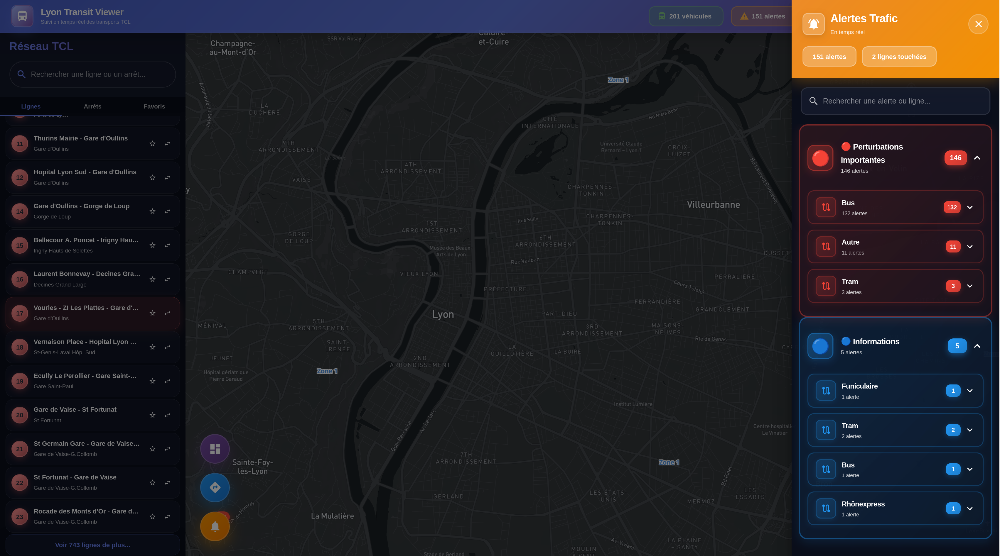

# Lyon Transit Viewer

Visualisation temps reel du reseau TCL (Lyon) avec calcul d'itineraire multimodal.

- Backend: module Rust sur SpacetimeDB (ingestion + procedures).
- Frontend: React + Mapbox + subscriptions SpacetimeDB.

## Quickstart Local

```bash
git clone https://github.com/Kyworn/lyon-transit-viewer.git
cd lyon-transit-viewer

cp frontend/.env.example frontend/.env
# puis renseigner REACT_APP_MAPBOX_TOKEN dans frontend/.env

spacetime start --listen-addr 127.0.0.1:3000
spacetime publish --server local --module-path spacetimedb/spacetimedb --yes lyon-transit

./scripts/set_config.sh "<email:password>"   # optionnel mais recommande pour realtime TCL
./scripts/ingest_daemon.sh

cd frontend
npm install
npm run build
python3 -m http.server 3001 --bind 127.0.0.1 -d build
```

- Frontend: `http://127.0.0.1:3001`
- SpacetimeDB: `http://127.0.0.1:3000`

## Documentation

- Setup local detaille: `SETUP.md`
- Deploiement VPS: `DEPLOY_VPS.md`
- Runbook exploitation: `docs/OPERATIONS.md`
- Reference de configuration: `docs/CONFIG_REFERENCE.md`
- Archive legacy Node/Postgres: `legacy/node-postgres/`

## Architecture

```text
[ APIs Externes TCL / GrandLyon ]
               |
               v
[ Module SpacetimeDB (Rust) ]
  - ingest_static
  - ingest_realtime
  - ingest_gtfs
  - calculate_journey
               |
               v
[ Tables SpacetimeDB ]
               |
               v
[ Frontend React ]
  - subscriptions WS
  - carte Mapbox
  - UI trajet + alertes + stats
```


### Suivi Vehicules

